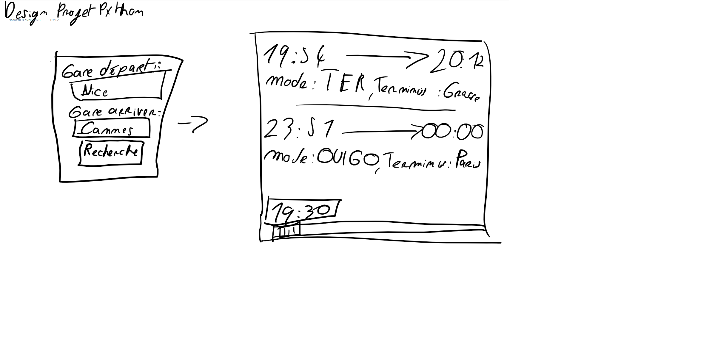
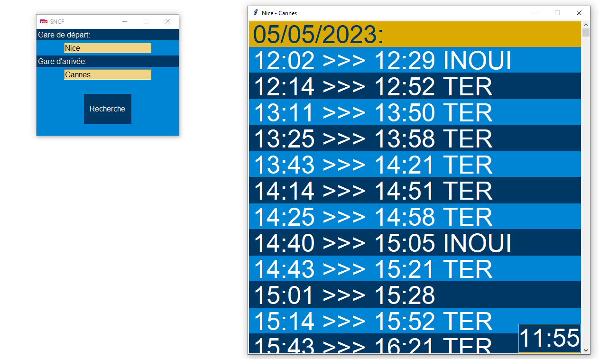

Lire sur GitHub (pour le markdown): https://github.com/Lax3n/SncfPythonTkinter

## Pré-requis:

### 1. pip :

- requests
- date

### 2. python

- Python 3.9 minimun (doit pouvoir typer des paramètres dans des fonctions)

 ### 3. API

- Une clé d'API de la SNCF (dans APIs.py (pas sur GitHub))

 ### 4. Police d'écriture

- Avenir-Medium.ttf (pour une meilleur expérience utilisateur) à installer avant de lancer le programme !
## Principal: 
Voici le projet Sncf Tkinter. Le but de ce programme et de pouvoir savoir des horaires de train entre 2 gares donc savoir l'horaire de départ et l'horaire d'arriver de chaque train.
Tout d'abord après avoir extrait le code du .zip il faut installer les librairie manquante:
```pip install resquests``` et ```pip install date``` (normalement déjà installer) et les installer sur un python 3.9 MINIMUN pour avoir le typage des paramètres dans les fonctions. La clé d'API ce trouve dans APIs.py (et tout est fait pour qu'elle ne soit pas visible sur GitHub) si vous n'avez pas de clé d'API il faudra en faire la demande au près de la SNCF et la mettre dans un fichier APIs.py.
## Avant après:
Design au départ du projet:


Design à la fin du projet: 

